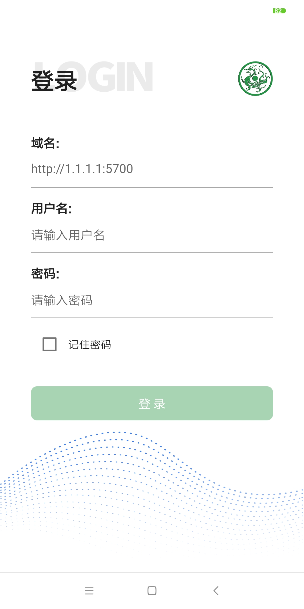
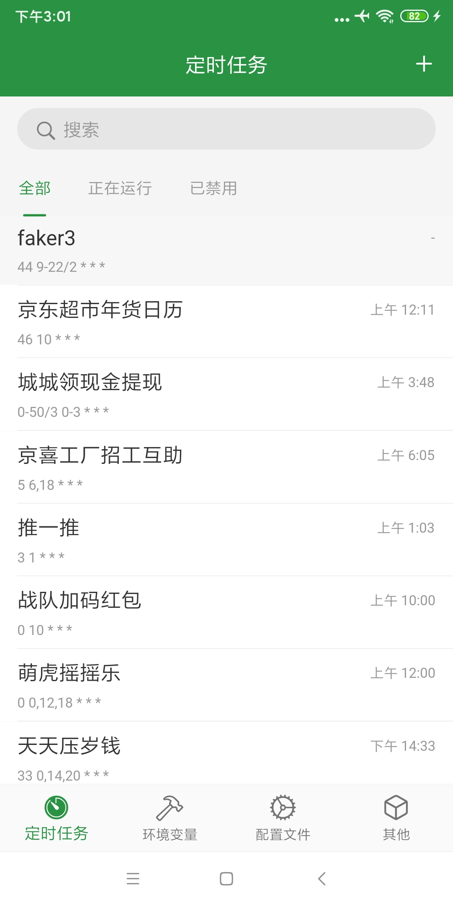
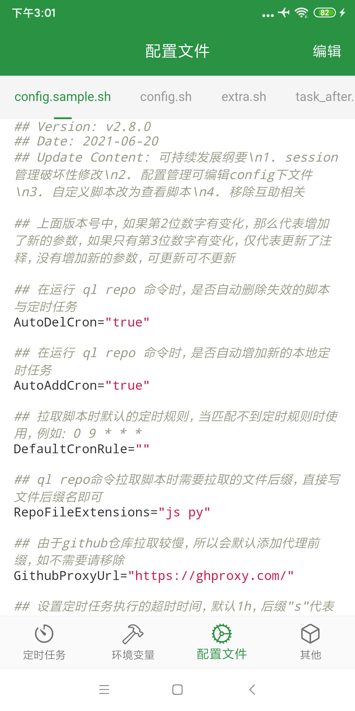
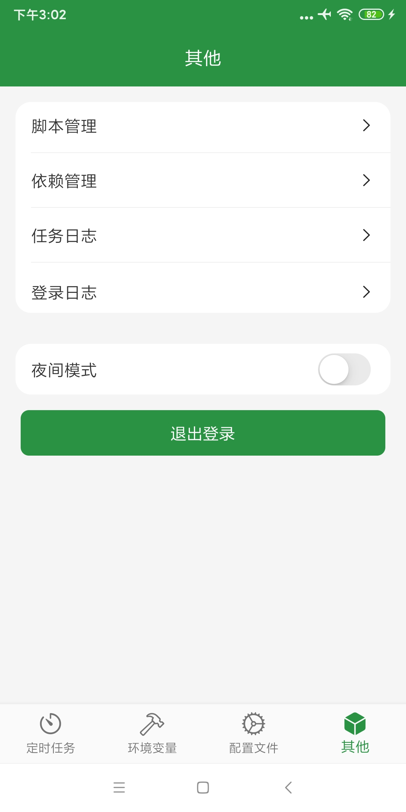
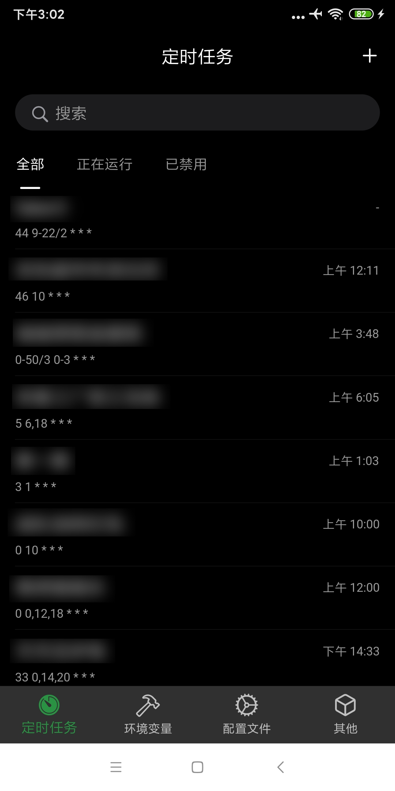
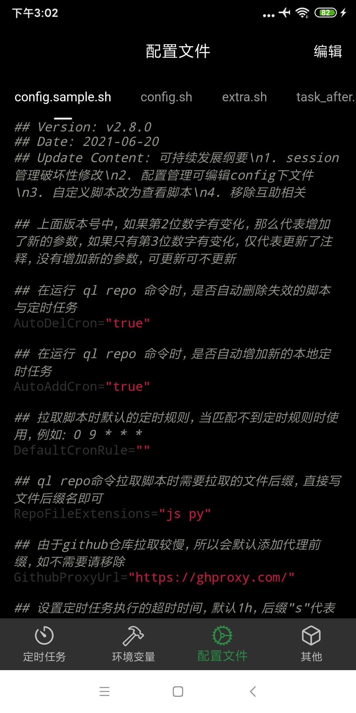

# qinglong_app

基于[qinglong](https://github.com/whyour/qinglong)API实现的三方客户端,采用Flutter编写

Android端去[release](https://github.com/qinglong-app/qinglong_app/releases)下载

本人没有iOS开发者账号,iOS端用户自行下载源码编译安装

禁止用于任何商业用途

  
   
  

  
   
  

### 尚未完成的功能
>* 两步验证
>* 应用设置
>* 通知设置
>* 脚本管理中的增删改和调试 