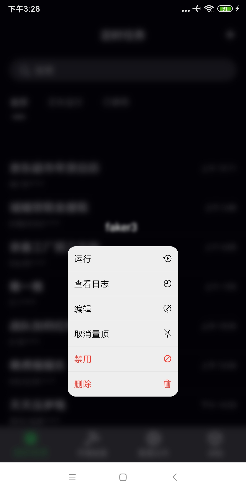
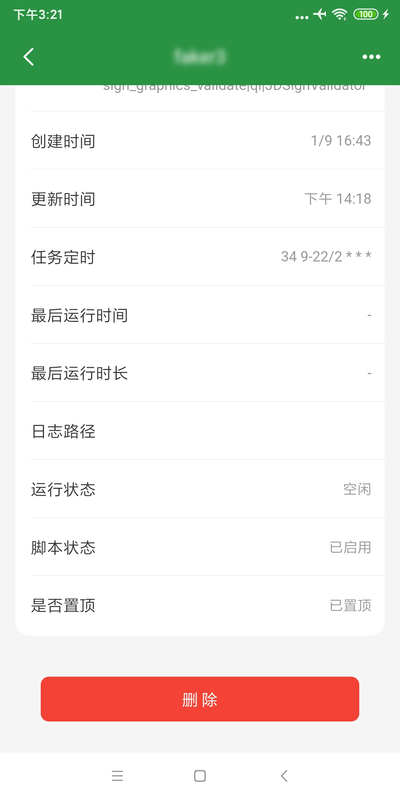
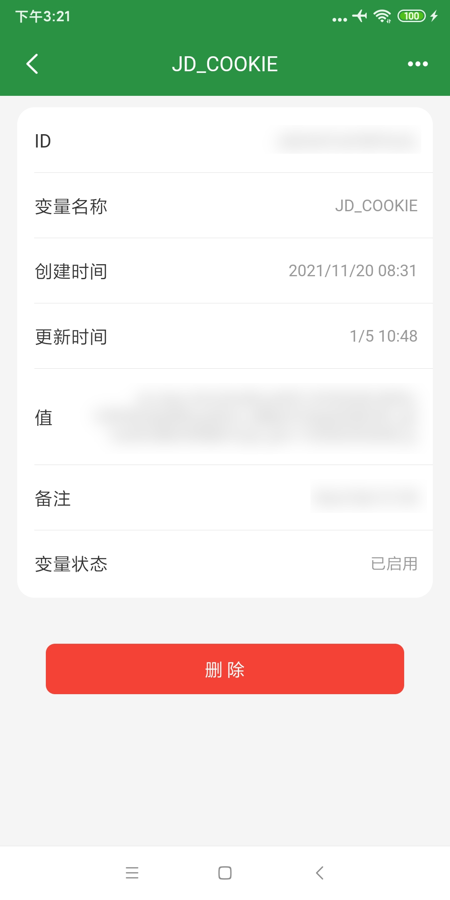
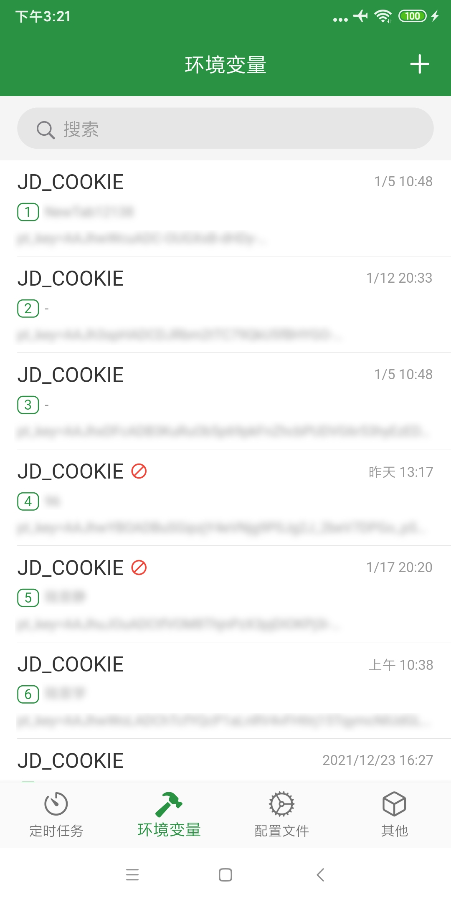
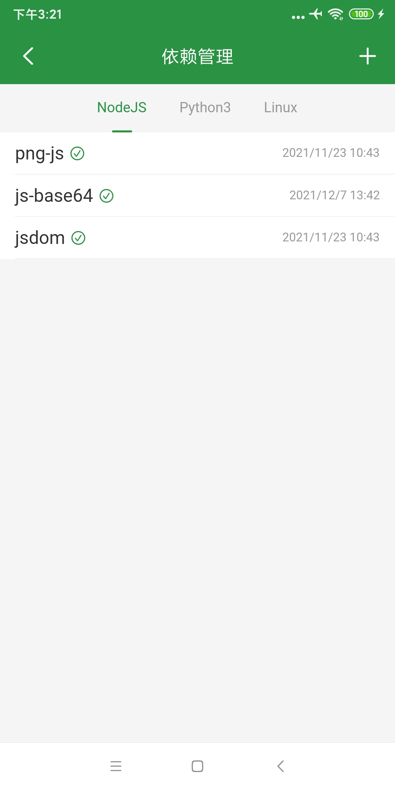

# qinglong_app

版本更新通知 https://t.me/qinglongapp

仅供学习交流, 禁止用于任何商业用途

基于[qinglong](https://github.com/whyour/qinglong)API实现的三方客户端,采用Flutter编写 (API基于v2.10.13)

Android端去[release](https://github.com/qinglong-app/qinglong_app/releases)下载

本人没有iOS开发者账号,iOS端用户自行下载main分支源码编译安装

目前只支持用户名密码登录,不用担心,你的用户名密码不会泄露

  
   
  

  
   
  

  
   
  

  
   
  

  

### 尚未完成的功能
>* 修改用户名密码
>* 两步验证
>* 应用设置
>* 通知设置
>* 脚本管理中的增删改和调试 
>* 暂不支持通过Client ID/Client Secret登录
